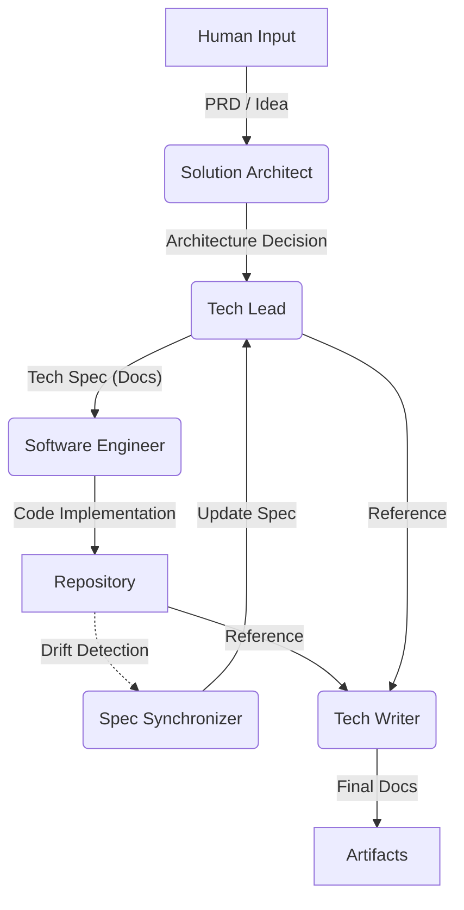

# AI Agents & Workflow

This directory defines the **Virtual Development Team** for projects adopting the `speckit-core` standard.

All agents act as **Principal-level Strategic Partners**, sharing the **SDD (Spec-Driven Development)** and **BMAD (Build, Measure, Agent, Document)** philosophies. They must collaborate organically based on their defined roles.

## 1. The Virtual Team Roster

Each agent possesses a dedicated directory containing its unique persona (`prompt.md`) and operational tools (Templates).

| Agent Name | Directory | Primary Objective | Input → Output |
| :--- | :--- | :--- | :--- |
| **Solution Architect (SA)** | `solution_architect/` | High-level System Design & Task Distribution | PRD/Wireframe → **ADR & Requirements** |
| **Tech Lead (TL)** | `tech_lead/` | Detailed Implementation Design (SDD Core) | Requirements → **Tech Specs** |
| **Software Engineer (SWE)** | `software_engineer/` | Flawless Code Implementation | Tech Specs → **Source Code** |
| **Spec Synchronizer** | `spec_synchronizer/` | Documentation Debt Clearance & Sync | Code Changes → **Updated Specs** |
| **Tech Writer (TW)** | `tech_writer/` | External Documentation | Specs & Code → **README / API Docs** |

---

## 2. Collaboration Workflow

We operate under the strict principle: **"No Implementation without Design."**

### Phase 1: Planning (SA & TL)
1.  **SA** analyzes user requirements to establish the system architecture and defines tasks for each repository.
2.  **TL** creates a detailed **Technical Specification (Tech Spec)** based on the assigned tasks. Database schemas and API interfaces are finalized at this stage.

### Phase 2: Implementation (SWE)
3.  **SWE** treats the Tech Spec as the absolute **Source of Truth** and converts it into code.
4.  Arbitrary design changes are prohibited, and `coding_convention` must be strictly followed.

### Phase 3: Maintenance (Sync & TW)
5.  **Sync** updates the Spec documentation if the code is modified directly by humans or if the implementation drifts from the design.
6.  **TW** creates user-friendly guides and documentation based on the final output.

---

## 3. The `_base` Directory (Shared Inheritance)

The `_base/` directory acts as the **Common Core** for all agents. To maintain consistency across different roles, every agent's prompt must start by inheriting these files.

### 3.1. `base_persona.md` (The Mindset)
Defines **WHO** the agent is.
- **Identity:** Strategic Partner (Not just a coder).
- **Communication:** Professional, Concise, No fluff.
- **Mandates:** "English Only" for deliverables, "Safety First" for secrets.

### 3.2. `common_tools.md` (The Protocol)
Defines **HOW** the agent works.
- **File Operations:** strict rules like "Read the file content before editing" to prevent blind overwrites.
- **Command Standards:** Standardized format for declaring actions (e.g., `[ACTION] {filename}`).

---

## 4. How to Use

To summon a specific agent, inject the content of its **`prompt.md`** into the LLM context.

> **Example:**
> "Act according to the instructions in `agents/solution_architect/prompt.md`. Here is the new PRD..."