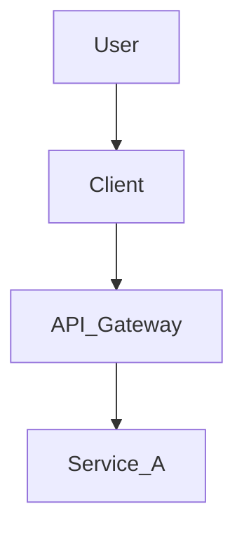

# [ADR-000] {Title of the Architecture Decision}

**Status:** {Proposed | Accepted | Deprecated}
**Date:** {YYYY-MM-DD}
**Author:** Solution Architect

## 1. Context & Problem Statement
> Describe the business goal or technical problem we are solving.
> *Example: We need a secure login system that supports multiple social providers.*

## 2. Architecture Drivers (Constraints)
* **Functional:** {List key features}
* **Non-Functional:** {Performance, Security, Cost constraints}
* **Constitution:** {Relevant clauses from global_constitution}

## 3. The Decision (Solution Strategy)
> Describe the chosen architecture/solution.
* **Tech Stack:** {Language, Framework, DB, Cloud Services}
* **Pattern:** {e.g., MVC, Event-Driven, Serverless}

### 3.1. System Diagram (Mermaid)

## 4. Consequences
* **Positive:** {Benefits}
* **Negative/Risks:** {Trade-offs accepted}

## 5. Requirements Breakdown (Hand-off to Tech Lead)
> Define the scope of work for each repository/component.

### Component A: `{Repo Name}`
* **Role:** {Brief description}
* **Key Features to Build:**
    * [ ] {Feature 1}
    * [ ] {Feature 2}
* **Special Instructions:** {e.g., Use specific library, Strict security required}

### Component B: `{Repo Name}`
* **Role:** ...
* **Key Features to Build:** ...